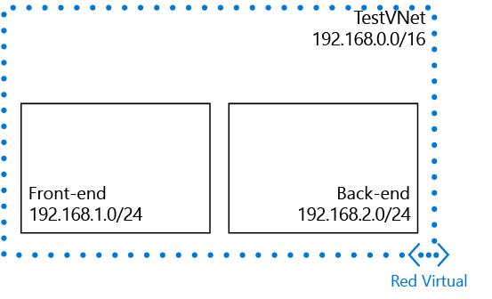

## Escenario

Para ilustrar cómo se crean redes virtuales y subredes, en este documento se usa el siguiente escenario:

En este escenario se crea una red virtual denominada **TestVNet** con un bloque CIDR reservado de **192.168.0.0./16**. La red virtual contiene las subredes siguientes: 

* **FrontEnd**, con **192.168.1.0/24** como su bloque CIDR.
* **BackEnd**, con **192.168.2.0/24** como su bloque CIDR.

