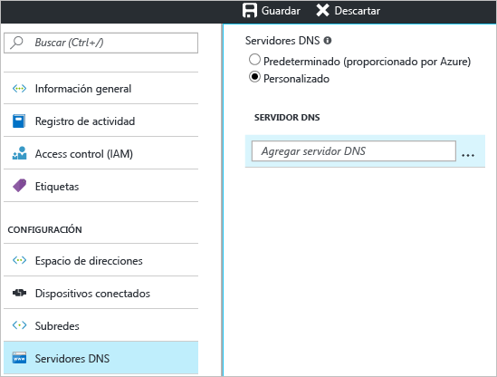

1. En la página **Configuración** de la red virtual, navegue a **Servidores DNS** y haga clic para abrir la hoja Servidores DNS.
2. En la página **Servidores DNS**, en **Servidores DNS**, seleccione **Personalizado**.
3. En el campo **Servidor DNS**, en el cuadro **Agregar servidor DNS**, escriba la dirección IP del servidor DNS que desea utilizar para la resolución de nombres. Cuando acabe de agregar servidores DNS, haga clic en **Guardar** en la parte superior de la hoja para guardar la configuración.

  