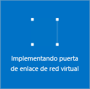

1. En el portal, vaya a **Nuevo** y seleccione **Redes**. Seleccione **Puerta de enlace de red virtual** de la lista.

	

2. En la hoja **Crear puerta de enlace de red virtual** en el campo **Nombre**, dé un nombre a la puerta de enlace. Esta acción no es igual a la de asignación de un nombre a una subred de puerta de enlace. Este es el nombre del objeto de puerta de enlace.
 
3. A continuación, elija la red virtual que desea implementar para esta puerta de enlace. Haga clic en la flecha para abrir la hoja **Elegir una red virtual** y, a continuación, haga clic en la red virtual. Para que la red virtual aparezca en la lista, debe tener ya una subred de puerta de enlace válida.

4. Elija una dirección IP pública. Haga clic en la flecha para abrir la hoja **Elegir dirección IP pública**. Luego haga clic en **Crear nueva** para abrir la hoja **Crear dirección IP pública**. Escriba un nombre para la dirección IP pública. Tenga en cuenta que esto no pide una dirección IP. La dirección IP se asignará dinámicamente. En cambio, este es el nombre del objeto de dirección IP a la que se asignará la dirección. Haga clic en **Aceptar** para guardar los cambios.

5. En **Tipo de puerta de enlace**, seleccione el tipo de puerta de enlace que se especifica para la configuración.

6. En **Tipo de VPN**, seleccione el tipo de VPN que se especifica para la configuración.

7. En **Suscripción**, compruebe que se selecciona la suscripción correcta.

8. En **Grupo de recursos**, el grupo de recursos vendrá determinado por la red virtual que seleccione.

9. En **Ubicación**, asegúrese de que muestra la ubicación del grupo de recursos y la red virtual.

10. Puede seleccionar **Anclar al panel** si desea que la puerta de enlace aparezca en el panel. Haga clic en **Crear** para crear la puerta de enlace. Verá el icono "Implementación de la puerta de enlace de red virtual" en el panel. La creación de una puerta de enlace puede tardar hasta 45 minutos. Hay muchos procesos que se ejecutan en segundo plano. Es posible que tenga que actualizar la página de portal para ver el estado completado.

	
	

11. Una vez creada la puerta de enlace, puede ver la dirección IP que se le ha asignado consultando la red virtual en el portal. La puerta de enlace aparecerá como un dispositivo conectado. Puede hacer clic en el dispositivo conectado (la puerta de enlace de red virtual) para más información.

<!---HONumber=AcomDC_0406_2016-->