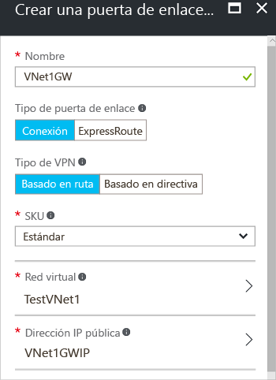

1. A la izquierda de la página del portal, haga clic en **+** y escriba "Puerta de enlace de red virtual" en la búsqueda. En **Resultados**, busque y haga clic en **Puerta de enlace de red virtual**. En la parte inferior de la hoja **Puerta de enlace de red virtual**, haga clic en **Crear**. Se abrirá la hoja **Crear puerta de enlace de red virtual**.
2. En la hoja **Create virtual network gateway** (Crear puerta de enlace de red virtual), rellene los valores de la puerta de enlace de red virtual.

    
3. **Nombre**: asigne un nombre a la puerta de enlace. Esta acción no es igual a la de asignación de un nombre a una subred de puerta de enlace. Este es el nombre del objeto de puerta de enlace que va a crear.
4. **Tipo de puerta de enlace**: seleccione **VPN**. Las puertas de enlace VPN usan el tipo de puerta de enlace de red virtual **VPN**. 
5. **Tipo de VPN**: seleccione el tipo de VPN que se especifica para la configuración. La mayoría de las configuraciones requieren un tipo de VPN basada en enrutamiento.
6. **SKU**: seleccione la SKU de puerta de enlace en la lista desplegable. Las SKU que aparecen en la lista desplegable dependen del tipo de VPN que seleccione.
7. **Ubicación**: puede que necesite desplazarse para ver la ubicación. Ajuste el campo **Ubicación** para que apunte a la ubicación en la que se encuentra la red virtual. Si la ubicación no apunta a la región en que reside la red virtual, esta no aparecerá en la lista desplegable "Elegir una red virtual" del paso siguiente.
8. **Red virtual**: elija la red virtual a la que quiera agregar esta puerta de enlace. Haga clic en **Virtual network** para abrir la hoja **Elegir una red virtual**. Seleccione la red virtual. Si no se muestra la red virtual, asegúrese de que el campo **Ubicación** apunta a la región en la que se encuentra la red virtual.
9. **Dirección IP pública**: esta hoja crea un objeto de dirección IP pública al que se le asignará dinámicamente una dirección IP pública. Haga clic en **Dirección de IP pública** para abrir la hoja **Elegir dirección IP pública**. Haga clic en **+Crear nueva** para abrir la hoja **Crear dirección IP pública**. Escriba un nombre para la dirección IP pública. Haga clic en **Aceptar** para guardar los cambios en esta hoja.

    
10. **Suscripción**: compruebe que se selecciona la suscripción correcta.
11. **Grupo de recursos**: este ajuste vendrá determinado por la red virtual que seleccione. 
12. No ajuste la **ubicación** después de especificar la configuración anterior.
13. Compruebe la configuración. Puede seleccionar **Anclar al panel** en la parte inferior de la hoja si quiere que la puerta de enlace aparezca en el panel.
14. Haga clic en **Crear** para comenzar a crear la puerta de enlace. Se validará la configuración y verá el icono "Implementación de la puerta de enlace de red virtual" en el panel. La creación de una puerta de enlace puede tardar hasta 45 minutos. Es posible que tenga que actualizar la página de portal para ver el estado completado.
    
    
15. Una vez creada la puerta de enlace, puede ver la dirección IP que se le ha asignado consultando la red virtual en el portal. La puerta de enlace aparecerá como un dispositivo conectado. Puede hacer clic en el dispositivo conectado (la puerta de enlace de red virtual) para más información.