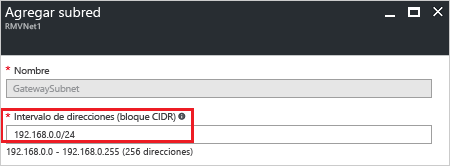

1. En el [portal](http://portal.azure.com), navegue a la red virtual de Resource Manager para la que desea crear una puerta de enlace de red virtual.
2. En la sección **Configuración** de la página de redes virtuales, haga clic en **Subredes** para expandir la página Subredes.
3. En la página **Subredes**, haga clic en **+Subred** para abrir la página **Agregar subred**.

  
4. El **nombre** de la subred se rellena automáticamente con el valor "GatewaySubnet". Este valor es necesario para que Azure reconozca que se trata de subred de puerta de enlace. Ajuste los valores de **Intervalo de direcciones** que se rellenan automáticamente para que coincidan con sus requisitos de configuración y haga clic en **Aceptar** en la parte inferior de la página para crear la subred.

  