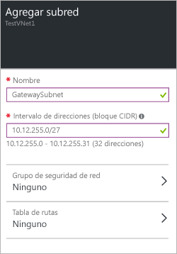

### Para crear una subred de puerta de enlace en el Portal de Azure

1. En el portal, navegue a la red virtual a la que desea conectar una puerta de enlace. En la hoja de la red virtual, haga clic en el icono **Configuración** situado en la parte superior de la hoja para expandir la hoja Configuración. 

2. En la hoja **Configuración**, haga clic en **Subredes** para expandir la hoja Subredes.

3. En la hoja **Subredes**, haga clic en **Agregar** para expandir la hoja **Agregar subred**.

	

4. En la hoja **Agregar subred**, asígnele el nombre **GatewaySubnet** a la subred. No utilice otro nombre; si lo hace, la puerta de enlace no funcionará.

5. Agregue el **intervalo de direcciones** IP de la puerta de enlace.

6. Haga clic en **Aceptar** en la parte inferior de la hoja para crear la subred.

<!---HONumber=AcomDC_0406_2016-->