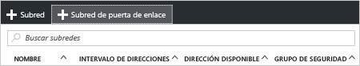

1. En el portal, navegue a la red virtual de Resource Manager para la que desea crear una puerta de enlace de red virtual.
2. En la sección **Configuración** de la hoja de redes virtuales, haga clic en **Subredes** para expandir la hoja Subredes.
3. En la hoja **Subredes**, haga clic en **+Subred de puerta de enlace** en la parte superior. Se abrirá la hoja **Agregar subred** . 
   
    
4. El **nombre** de la subred se rellenará automáticamente con el valor GatewaySubnet. Este valor es necesario para que Azure reconozca que se trata de subred de puerta de enlace. Modifique los valores de **Intervalo de direcciones** rellenados automáticamente para ajustarlos a sus requisitos de configuración.

    
5. Haga clic en **Aceptar** en la parte inferior de la hoja para crear la subred.

<!--HONumber=Jan17_HO3-->

