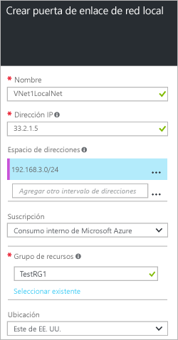

1. En el portal, vaya a **Nuevo** > **Redes** > **Puerta de enlace de red local**.
   
    
2. En la hoja **Crear puertas de enlace de red local**, especifique un **nombre** para el objeto de puerta de enlace de red local.
3. Especifique una **dirección IP** pública para el dispositivo VPN o la puerta de enlace de red virtual a la que quiera conectarse. Si esta red local representa una ubicación local, será dirección IP pública del dispositivo VPN al que quiere conectarse. No puede encontrarse detrás de NAT y debe estar al alcance de Azure. Si esta red local representa otra red virtual, especificará la dirección IP pública que se asignó a la puerta de enlace de red virtual de esa red virtual. 
4. **Espacio de direcciones** hace referencia a los intervalos de direcciones de la red que representa esta red local. Puede agregar varios intervalos de espacios de direcciones. Asegúrese de que los intervalos que especifique aquí no se superpongan con los de otras redes a las que quiera conectarse.
5. En **Suscripción**, compruebe que se muestra la suscripción correcta.
6. En **Grupo de recursos**, seleccione el grupo de recursos que desea utilizar. Puede crear un grupo de recursos nuevo o seleccionar uno ya creado.
7. En **Ubicación**, seleccione la ubicación en la que se creará este objeto. Puede seleccionar la misma ubicación en la que reside la red, pero no es obligatorio.
8. Haga clic en **Crear** para crear la puerta de enlace de red local.

<!----HONumber=AcomDC_0810_2016-->