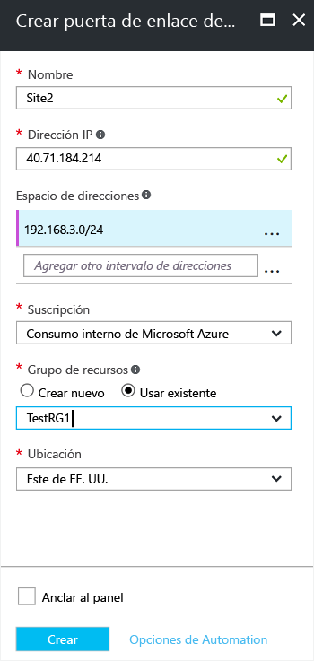

1. En el portal, en **Todos los recursos**, haga clic en **+Agregar**. 
2. En el cuadro de búsqueda de la hoja **Todo**, escriba **Puerta de enlace de red local** y, a continuación, haga clic para buscar. Esto devolverá una lista. Haga clic en **Puerta de enlace de red local** para abrir la hoja, a continuación, haga clic en **Crear** para abrir la hoja **Crear puerta de enlace de red local**.

  

3. En la hoja **Crear puerta de enlace de red local**, especifique los calores de la puerta de enlace de red local.

  - **Nombre:** especifique el nombre del objeto de puerta de enlace de red local.
  - **Dirección IP:** es la dirección IP pública del dispositivo VPN al que desea que Azure se conecte. Especifique una dirección IP pública válida. La dirección IP no puede encontrarse detrás de NAT y Azure debe poder acceder a ella. Si no tiene la dirección IP en este momento, puede usar los valores que se muestran en la captura de pantalla, pero deberá volver y reemplazar la dirección IP del marcador por la dirección IP pública de su dispositivo VPN. Si no lo hace, Azure no podrá conectarse.
  - **Espacio de direcciones** hace referencia a los intervalos de direcciones de la red que representa esta red local. Puede agregar varios intervalos de espacios de direcciones. Asegúrese de que los intervalos que especifique aquí no se superpongan con los de otras redes a las que quiera conectarse. Azure enrutará el intervalo de direcciones que especifique a la dirección IP del dispositivo VPN local. *Utilice aquí sus propios valores, no los valores mostrados en la captura de pantalla*.
  - **Suscripción:** compruebe que se muestra la suscripción correcta.
  - **Grupo de recursos:** seleccione el grupo de recursos que desea utilizar. Puede crear un grupo de recursos nuevo o seleccionar uno ya creado.
  - **Ubicación:** seleccione la ubicación en la que se creará este objeto. Puede seleccionar la misma ubicación en la que reside la red, pero no es obligatorio.

4. Cuando haya terminado de especificar los valores, haga clic en **Crear** en la parte inferior de la hoja para crear la puerta de enlace de red local.