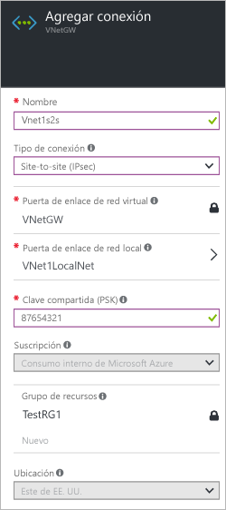
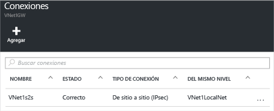

1. Busque la puerta de enlace de red virtual y haga clic en **Todas las configuraciones** para abrir la hoja **Configuración**.

2. En la hoja **Configuración**, haga clic en **Conexiones** y, después, haga clic en **Agregar** en la parte superior de la hoja para abrir la hoja **Agregar conexión**.

	

3. En la hoja **Agregar conexión**, asigne un **nombre** a la conexión.

4. En **Tipo de conexión**, seleccione **Sitio a sitio (IPsec)**.

5. En **Puerta de enlace de red virtual**, el valor es fijo porque se conecta desde esta puerta de enlace.

6. En **Puerta de enlace de red local**, haga clic en **Elegir una puerta de enlace de red local** y seleccione la puerta de enlace de red local que desea utilizar.

7. En **Clave compartida**, el valor que aparece aquí debe coincidir con el que está usando para el dispositivo VPN local. Si el dispositivo VPN de la red local no proporciona una clave compartida, puede inventar una e ingresarla aquí y en el dispositivo local. Lo importante es que ambas coincidan.

8. Los valores restantes para **Suscripción**, **Grupo de recursos** y **Ubicación** son fijos.

9. Haga clic en **Aceptar** para crear la conexión. El mensaje *Creando conexión* aparecerá de forma intermitente en la pantalla.

10. Cuando se complete la conexión, aparecerá en la hoja **Conexiones** de su puerta de enlace.

	

<!----HONumber=AcomDC_0406_2016-->