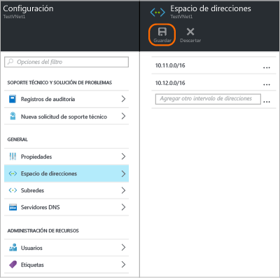
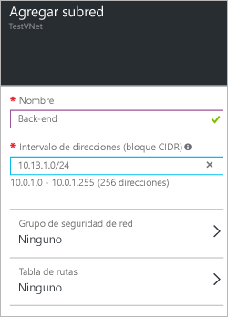

### Para agregar espacio de direcciones:
1. Para agregar espacio de direcciones adicional, haga clic en **Todas las configuraciones** para abrir la hoja **Configuración**. 
2. En la hoja **Configuración**, haga clic en **Espacio de direcciones** para abrir la hoja Espacio de direcciones. Agregue el espacio de direcciones adicional en esta hoja y, después, haga clic en **Guardar** en la parte superior de la hoja.
   
    

### Para agregar subredes
1. Para agregar subredes adicionales a los espacios de direcciones, en la hoja **Configuración**, haga clic en **Subredes** para abrir la hoja **Subredes**. 
2. En la hoja Subredes, haga clic en **Agregar** para abrir la hoja **Agregar subred**. Asigne un nombre a la nueva subred y especifique el intervalo de direcciones y, después, haga clic en **Aceptar** en la parte inferior de la hoja. Una vez creada una subred, puede usar la hoja Subredes para ver todas las subredes de una red virtual.

    

<!----HONumber=AcomDC_0406_2016-->