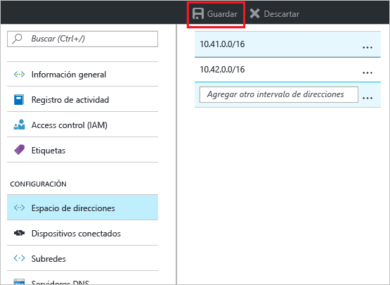
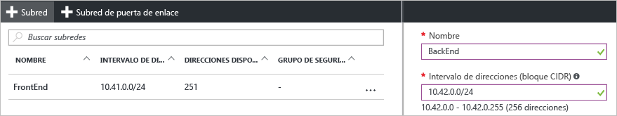

### Para agregar un espacio de direcciones adicional

1. Para agregar un espacio de direcciones adicional, en la sección **Configuración** de la página de la red virtual, haga clic en **Espacio de direcciones** para abrir la página Espacio de direcciones.
2. Agregue el espacio de direcciones adicional y haga clic en **Guardar** en la parte superior de la página.

  

### Para crear subredes adicionales

1. Para crear subredes, en la sección **Configuración** de la página de la red virtual, haga clic en **Subredes** para abrir la página **Subredes**. 
2. En la página Subredes, haga clic en **+Subred** para abrir la página **Agregar subred**. Asigne un nombre a la nueva subred y especifique el intervalo de direcciones.

  
3. Para guardar los cambios, haga clic en **Aceptar** en la parte inferior de la página.

  