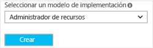
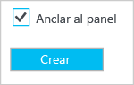
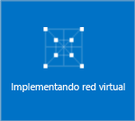

Para crear una red virtual mediante el Portal de Azure, siga estos pasos. Tenga en cuenta que las capturas de pantalla se proporcionan a modo de ejemplos. Asegúrese de reemplazar los valores por los suyos.

Para más información sobre redes virtuales, consulte [Información general sobre redes virtuales](../articles/virtual-network/virtual-networks-overview.md).

1. Desde un explorador, vaya al [Portal de Azure](http://portal.azure.com) y, si fuera necesario, inicie sesión con su cuenta de Azure.

2. Haga clic en **Nueva** **>** **Redes** **>** **Red Virtual**.

	

3. En la parte inferior de la hoja Red virtual, en la lista **Seleccionar un modelo de implementación**, seleccione **Administrador de recursos** y, finalmente, haga clic en **Crear**.

	

4. En la hoja **Crear red virtual**, configure los valores de la red virtual. En esta hoja, agregará el primer espacio de direcciones y un intervalo de direcciones de subred único. Cuando termine de crear la red virtual, puede volver atrás y agregar espacios de direcciones y subredes adicionales. Se trata de una limitación actual del portal. Siempre puede volver a actualizar estos valores editando las propiedades de red virtual en el portal o mediante PowerShell. Los valores que utilice dependerán de la configuración que desee crear. Asegúrese de hacer referencia a sus valores de configuración planeados.

	

5. Compruebe que la **Suscripción** es la correcta. Puede cambiar las suscripciones mediante la lista desplegable.

6. Haga clic en **Grupo de recursos** y seleccione un grupo de recursos existente, o bien cree uno nuevo escribiendo un nombre para el nuevo grupo. Si va a crear un nuevo grupo, dé un nombre al grupo de recursos según los valores de configuración planeados. Para obtener más información sobre los grupos de recursos, visite [Información general del Administrador de recursos de Azure](resource-group-overview.md/#resource-groups).

7. A continuación, seleccione la configuración de **Ubicación** de la red virtual. Tenga en cuenta que la ubicación determinará dónde van a residir los recursos que se implementen en esta red virtual. No se puede cambiar esto más adelante sin tener que volver a implementar los recursos.

8. Seleccione **Anclar al panel** si desea encontrar la red virtual fácilmente en el panel y, a continuación, haga clic en **Crear**.
	
	

9. Después de hacer clic en Crear, verá un icono en el panel que reflejará el progreso de la red virtual. El icono cambiará a medida que se vaya creando la red virtual.

	

<!---HONumber=AcomDC_0406_2016-->