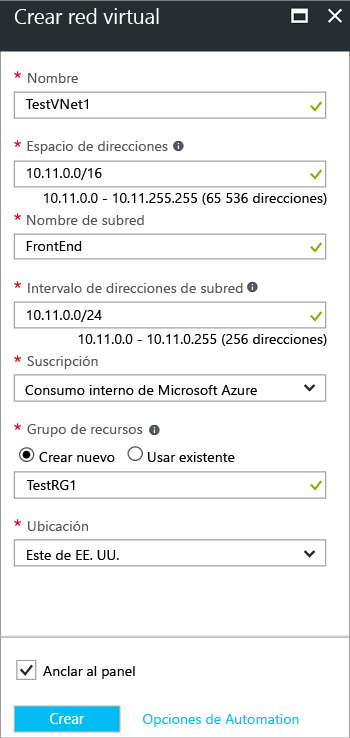

Para crear una red virtual con el modelo de implementación de Resource Manager mediante Azure Portal, siga los pasos que se indican a continuación. Si va a utilizar estos pasos como tutorial, use los [valores de ejemplo](#values). Si no va a hacerlo, asegúrese de reemplazar los valores por los suyos. Para más información sobre redes virtuales, consulte [Información general sobre redes virtuales](../articles/virtual-network/virtual-networks-overview.md).

1. Desde un explorador, navegue al [Portal de Azure](http://portal.azure.com) e inicie sesión con su cuenta de Azure.
2. Haga clic en **Nuevo**. En el campo **Buscar en el Marketplace**, escriba "Red virtual". En la lista de resultados, busque **Red virtual** y haga clic en él para abrir la hoja **Red virtual**.
3. En la parte inferior de la hoja Red virtual, en la lista **Seleccionar un modelo de implementación**, seleccione **Resource Manager** y, finalmente, haga clic en **Crear**. Se abrirá la hoja "Crear red virtual".

    
4. En la hoja **Crear red virtual** , configure los valores de la red virtual. Al rellenar los campos, el signo de exclamación rojo se convierte en una marca de verificación verde cuando los caracteres escritos en el campo sean válidos.

  - **Nombre**: escriba el nombre de la red virtual. En este ejemplo, se usa TestVNet1.
  - **Espacio de direcciones**: escriba el espacio de direcciones. Si tiene varios espacios de direcciones que agregar, agregue su primer espacio de direcciones. Podrá agregar más espacios de direcciones posteriormente, tras crear la red virtual. Asegúrese de que el espacio de direcciones que especifique no se superpone con el espacio de direcciones para la ubicación local.
  - **Nombre de subred**: agregue el nombre de la primera subred y el intervalo de direcciones de la subred. Más adelante, después de crear esta red virtual, podrá agregar más subredes y la subred de la puerta de enlace. 
  - **Suscripción**: compruebe que la suscripción que se enumera es la correcta. Puede cambiar las suscripciones mediante la lista desplegable.
  - **Grupo de recursos**: seleccione un grupo de recursos existente, o bien cree uno nuevo y escriba su nombre. Si va a crear un nuevo grupo, dé un nombre al grupo de recursos según los valores de configuración planeados. Para obtener más información sobre los grupos de recursos, visite [Información general del Administrador de recursos de Azure](../articles/azure-resource-manager/resource-group-overview.md#resource-groups).
  - **Ubicación**: seleccione la ubicación de la red virtual. La ubicación determina dónde van a residir los recursos que se implementen en esta red virtual.

5. Seleccione **Anclar al panel** si desea encontrar la red virtual fácilmente en el panel y, luego, haga clic en **Crear**. Después de hacer clic en **Crear**, verá un icono en el panel que reflejará el progreso de la red virtual. El icono cambiará a medida que se vaya creando la red virtual.