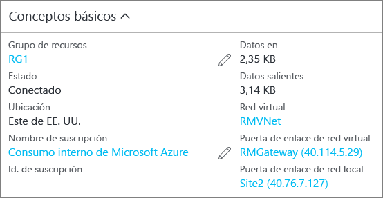

### Para comprobar la conexión mediante PowerShell

Puede comprobar que la conexión se realizó correctamente mediante el cmdlet `Get-AzureRmVirtualNetworkGatewayConnection`, con o sin `-Debug`. 

1. Puede usar el siguiente ejemplo de cmdlet, configurando los valores para que coincidan con los tuyos. Cuando se le pida, seleccione "A" para ejecutar "todo". En el ejemplo, `-Name` hace referencia al nombre de la conexión que creó y quiere probar.

        Get-AzureRmVirtualNetworkGatewayConnection -Name MyGWConnection -ResourceGroupName MyRG

2. Cuando el cmdlet haya finalizado, consulte los valores. En el ejemplo siguiente, el estado de conexión aparece como "Conectado" y pueden verse los bytes de entrada y salida.

        Body:
        {
          "name": "MyGWConnection",
          "id":
        "/subscriptions/086cfaa0-0d1d-4b1c-94544-f8e3da2a0c7789/resourceGroups/MyRG/providers/Microsoft.Network/connections/MyGWConnection",
          "properties": {
            "provisioningState": "Succeeded",
            "resourceGuid": "1c484f82-23ec-47e2-8cd8-231107450446b",
            "virtualNetworkGateway1": {
              "id":
        "/subscriptions/086cfaa0-0d1d-4b1c-94544-f8e3da2a0c7789/resourceGroups/MyRG/providers/Microsoft.Network/virtualNetworkGa
        teways/vnetgw1"
            },
            "localNetworkGateway2": {
              "id":
        "/subscriptions/086cfaa0-0d1d-4b1c-94544-f8e3da2a0c7789/resourceGroups/MyRG/providers/Microsoft.Network/localNetworkGate
        ways/LocalSite"
            },
            "connectionType": "IPsec",
            "routingWeight": 10,
            "sharedKey": "abc123",
            "connectionStatus": "Connected",
            "ingressBytesTransferred": 33509044,
            "egressBytesTransferred": 4142431
          }

### Para comprobar la conexión mediante el Portal de Azure

En el Portal de Azure, puede ver el estado de conexión navegando a la conexión. Hay varias formas de hacerlo. Los pasos siguientes muestran una manera de navegar a su conexión y realizar las comprobaciones necesarias.

1. En [Azure Portal](http://portal.azure.com), haga clic en **Todos los recursos** y navegue a la puerta de enlace de la red virtual.
2. En la hoja de la puerta de enlace de la red virtual, haga clic en **Conexiones**. Puede ver el estado de cada conexión.
3. Haga clic en el nombre de la conexión que desee comprobar para abrir **Essentials**. En Essentials, puede ver más información acerca de la conexión. El valor de **Estado** será "Correcto" y "Conectado" cuando haya realizado una conexión satisfactoria.

    

<!--HONumber=Oct16_HO2-->

